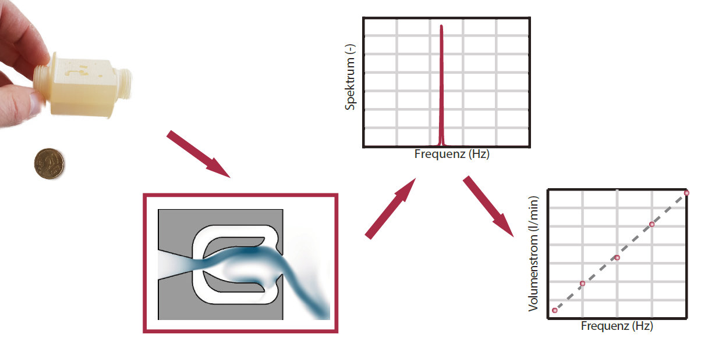

# OsciBreath

A volume flowmeter for medical ventilators based on OsciJet Technology.

**Please note that this is work in progress and may be undergo heavy changes**

## About ##

The purpose of this project is to provide a precise and cost effective volume flow meter for medical ventilators. It is intended to be used free of charge for DIY and other non-commercial projects. We intentionally used a nozzle that is patented, so that the technology cannot be charged or patented by a troll. The device consists of two parts, a hardware part consisting of the device itself and a microcontroller with a microphone, and a firmware for the microcontroller. 

## Working Principal

In brief, the idea is that when the device is fed with air it creates a flow instability in its interior. The frequeny of this flow instability is linearly linked to the volume flow. By capturing the oscillation through using a microcontroller with a microphone the volume flow can be determined.



Read more in the wiki or at [fdx.de](https://fdx.de/blog/oscibreath).

## Hardware  ##

In the hardware folder you will find the geometry in a CAD file format which can be used to 3D print the device. You will also find some drawings and instrucions how to set up the microcontroller (STM32, bluepill)

## Software

These instructions will get you a copy of the project up and running on your local machine for development and testing purposes. See deployment for notes on how to deploy the project on a live system.

### Prerequisites

You will need either the Arduino IDE or Visual Studio Code with Platform.IO. The latter one is recommendend. Links see below.


### Compiling

In order to compile the firmware you will just have to clone the repositry to your computer and load it ...

```
git clone
```

### FFT Library

We were using the FFT Library [arduinoFFT](https://github.com/kosme/arduinoFFT) by kosme, which was licensend under GNU GPL v3. We did some changes to the library and added it tothis repository. 

## Built With

* [Visual Studio Code](https://code.visualstudio.com/) - The IDE used
* [Platform.io](https://platform.io/) - The extension for VSC to compile and upload the firmware

## Contributing

Please read [CONTRIBUTING.md](https://gist.github.com/PurpleBooth/b24679402957c63ec426) for details on our code of conduct, and the process for submitting pull requests to us.

## Authors

* **Thorge Schweitzer** - *Initial work* 
* **Oliver Krüger** - *Initial work* 

See also the list of [contributors](https://github.com/your/project/contributors) who participated in this project.

## License

The FDX logo is a registered trademark of the Fluid Dynamix GmbH. Despite the logo, the further content of this project itself is licensed under the [Creative Commons Attribution-NonCommercial-ShareAlike 4.0 International License](http://creativecommons.org/licenses/by-nc-sa/4.0/), and the source code for the firmware is used in this project is licensed under the [GNU GPL Version 3](http://www.gnu.org/licenses/gpl-3.0.html).

**Please note:** The hardware device is **patented** by FDX Fluid Dynamix GmbH. The unaltered device may be used free of charge for non-commercial use in medical ventilators. For commercial use please contact us via email [info@fdx.de](mailto:info@fdx.de) or another channel found at our website [www.fdx.de](https://www.fdx.de/). 

## Acknowledgments

* Hat tip to Cubicure GmbH for supporting the project